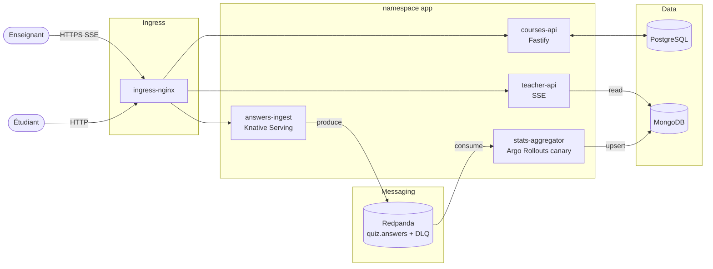

# Architecture EduStream

## Vue d'ensemble



## Topology Redpanda

| Topic | Partitions | Producer | Consumer |
|---|---|---|---|
| `quiz.answers` | 3 | answers-ingest | stats-aggregator (CG `aggregator`) |
| `quiz.answers.dlq` | 1 | stats-aggregator (sur erreur parse) | — (rétention 7 j, debug manuel) |

## Modèles de données

### PostgreSQL (courses-api)

```sql
courses (id uuid pk, title, description, created_at)
quizzes (id uuid pk, course_id fk, title, opens_at, closes_at)
questions (id uuid pk, quiz_id fk, prompt, correct_choice int, choices jsonb)
sessions (id uuid pk, quiz_id fk, started_at, ended_at)
```

### MongoDB (stats-aggregator)

```js
// collection: session_stats
{
  _id: "<sessionId>:<questionId>",
  sessionId, questionId,
  window: "10s",
  total: 1234,
  correct: 987,
  wrong_choices: { "1": 100, "2": 147 },
  avg_latency_ms: 1820,
  last_updated_at: ISODate
}
```

## SLO

| SLO | Cible | Window | Métrique source |
|---|---|---|---|
| answers-ingest success rate | ≥ 99.5 % | 1h | `http_requests_total{job="answers-ingest",status!~"5.."}` |
| teacher-api latency P95 | < 300 ms | 1h | `http_request_duration_seconds_bucket{job="teacher-api"}` |

Error budget calculé en recording rules Prometheus, alerte Alertmanager si budget brûlé > 50 % en 1 h.

## Sécurité

- NetworkPolicies deny-by-default sur namespace `app`, autorise uniquement :
  - `ingress-nginx` → `courses-api`, `answers-ingest`, `teacher-api`
  - `answers-ingest` → `redpanda.messaging`
  - `stats-aggregator` → `redpanda.messaging`, `mongodb.data`
  - `courses-api` → `postgresql.data`
  - `teacher-api` → `mongodb.data`
- ServiceAccount dédié par service + RoleBinding minimal.
- Secrets via Vault dev-mode + External Secrets Operator (DB passwords, JWT secret).
- mTLS externe via cert-manager self-signed (Linkerd impossible sur 8 Go RAM).
